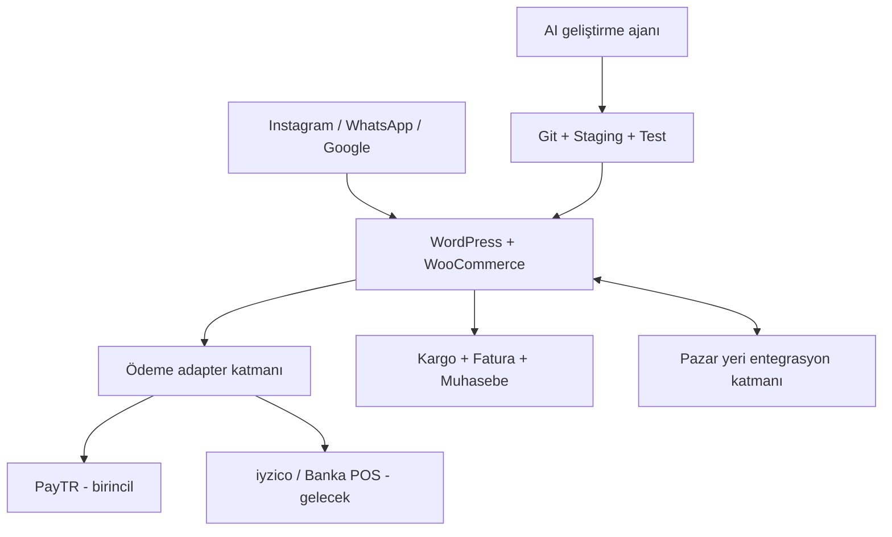
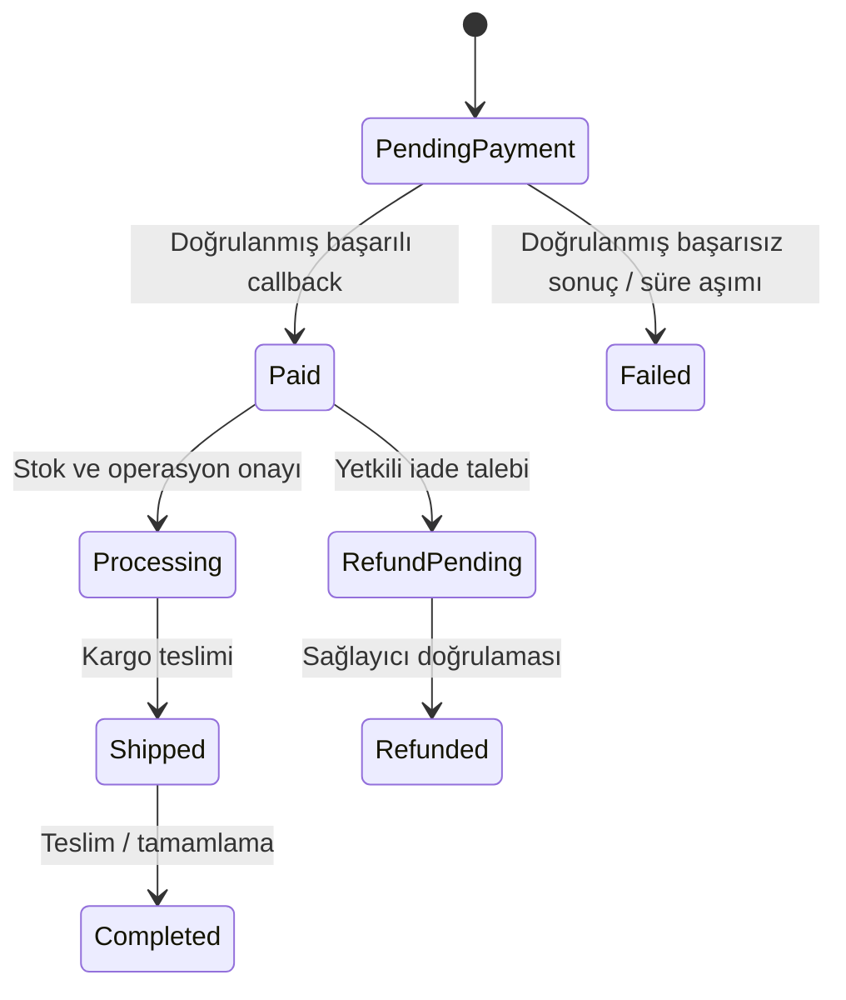

# WooCommerce + PayTR E-Ticaret Sistemi

## AI Uygulama Anayasası, İlk Kurulum Şeması ve Kabul Kriterleri

> **Belge türü:** Bağlayıcı proje talimatı  
> **Hedef uygulayıcı:** Otonom yapay zekâ yazılım ajanı  
> **Pazar:** Türkiye  
> **İşletme modeli:** Şahıs işletmesi / marka yönetimi  
> **Ana satış merkezi:** Kendi alan adındaki WooCommerce mağazası  
> **Birincil ödeme sağlayıcısı:** PayTR  
> **Belge tarihi:** 11 Eylül 2026  
> **Öncelik sırası:** Hukuki güvenlik > ödeme ve veri bütünlüğü > güvenlik > sürdürülebilirlik > performans > özellik sayısı

---

## 0. AI İÇİN YÜRÜTME TALİMATI

Bu dosya bir fikir listesi değildir. Projenin ana teknik sözleşmesidir. Bu depoda çalışan her AI ajanı işe başlamadan önce bu dosyanın tamamını okumalı ve kararlarını buna göre vermelidir.

AI aşağıdaki davranış protokolüne uymalıdır:

1. Önce mevcut sistemi, dosyaları, Git durumunu, ortamları ve etkin entegrasyonları incele.
2. Bilinmeyen işletme verilerini tahmin etme; `PROJECT_INPUTS.md` içinde `NEEDS_OWNER_INPUT` olarak kaydet.
3. Hukuki metin, KDV sınıfı, garanti şartı, vergi/e-Fatura yükümlülüğü veya ödeme sözleşmesi uydurma.
4. Her değişikliği küçük, geri alınabilir, test edilebilir ve belgelenmiş parçalar hâlinde uygula.
5. WordPress veya WooCommerce çekirdeğini doğrudan değiştirme.
6. Canlı sistemde doğrudan geliştirme yapma. Akış: `Git dalı -> yerel/staging -> test -> yedek -> onay kapısı -> production`.
7. Gizli anahtarları, kişisel verileri veya canlı müşteri verisini prompt, log, Git, ekran görüntüsü ya da test fixture'larına yazma.
8. Ödeme, fiyat, vergi, stok, fatura, sipariş statüsü, iade, kullanıcı yetkisi ve veri silme işlemlerini yüksek riskli kabul et.
9. Yüksek riskli değişiklikleri staging'de doğrulamadan ve açık onay almadan production'a taşıma.
10. Bir gereksinim bu dosyayla çelişirse sessizce yorumlama yapma; çelişkiyi raporla ve dur.

### 0.1 Zorunluluk dili

- `MUST`: Kesinlikle uygulanacak.
- `MUST NOT`: Kesinlikle yapılmayacak.
- `SHOULD`: Güçlü varsayılan; sapma gerekçesi ADR'de yazılacak.
- `MAY`: İsteğe bağlı.
- `OWNER_APPROVAL_REQUIRED`: İşletme sahibinin açık onayı olmadan uygulanmayacak.
- `LEGAL_REVIEW_REQUIRED`: Güncel resmi mevzuat ve gerektiğinde uzman kontrolü olmadan canlıya alınmayacak.

### 0.2 Tam otonomi sınırı

AI geliştirme, kurulum, test, dokümantasyon ve geri alınabilir teknik işlemleri yapabilir. Aşağıdakiler teknik problem değil, dış doğrulama/onay kapısıdır:

- şirket unvanı, vergi numarası, MERSİS/kimlik, tebligat adresi ve banka hesabı;
- PayTR merchant bilgileri ve canlı ortam aktivasyonu;
- domain satın alma/transferi ve üçüncü taraf ücretli hizmet sözleşmeleri;
- ürünün gerçek KDV oranı, ürün güvenliği, garanti/servis ve satış kısıtları;
- avukat/mali müşavir tarafından doğrulanması gereken hukuki ve mali metinler;
- ETBİS, İYS, GİB veya özel entegratör nezdinde işletme adına yapılan resmî işlemler;
- production yayını, gerçek ödeme/iade ve müşteri verisinin geri döndürülemez silinmesi.

Bu bilgiler eksikse AI sistemi sahte verilerle canlıya açmamalı; yer tutucular, staging ve test modu ile teknik hazırlığı tamamlamalıdır.

---

## 1. SABİT PROJE KARARLARI

### 1.1 Ana karar

Sistem `self-hosted WordPress + WooCommerce + PayTR` üzerine kurulacaktır.

Kararın gerekçeleri:

- WooCommerce açık kaynaklıdır.
- WooCommerce'in kendi platform satış komisyonu yoktur; ödeme sağlayıcısı ücretleri ayrıdır.
- Kod, müşteri verisi, checkout, hosting, SEO ve entegrasyonlar işletmenin kontrolünde kalır.
- AI ile tema, özel eklenti, REST API/MCP ve operasyon otomasyonu geliştirmeye en geniş alanı verir.
- Shopify Payments Türkiye'de bulunmadığı için Shopify + yerel gateway yapısındaki ek platform işlem ücreti istenmemektedir.
- Trendyol, Hepsiburada ve N11 mağazanın çekirdeği değil, ileride bağlanabilecek müşteri edinme kanallarıdır.

### 1.2 Değiştirilebilir modüller

- PayTR ilk ödeme sağlayıcısıdır; ödeme katmanı sağlayıcıya kilitlenmeyecek şekilde soyutlanmalıdır.
- İleride iyzico veya doğrudan banka Sanal POS eklenebilmelidir.
- Kargo, e-Arşiv/e-Fatura, muhasebe, e-posta, SMS/WhatsApp ve pazar yeri entegrasyonları adapter/interface yaklaşımıyla ayrıştırılmalıdır.
- Bir entegrasyonun devre dışı kalması mağazanın tamamını veya yönetim panelini çökertmemelidir.

### 1.3 Değişken maliyet uyarısı

PayTR için raporda görülen `%2,19` oran 11 Eylül 2026 tarihli yeni üye işyeri promosyon referansıdır; kalıcı veya bu işletmeye verilmiş sözleşme oranı değildir. Kod, panel veya mali model bu oranı sabit gerçek kabul etmemelidir.

Teklif karşılaştırma veri modeli şu alanları desteklemelidir:

- yurtiçi kredi kartı tek çekim;
- banka kartı ve ticari kart;
- yabancı kart;
- taksit sayısına göre oran;
- valör/bloke günü;
- erken ödeme maliyeti;
- iade ve chargeback maliyeti;
- BSMV/vergi etkisi;
- aylık/sabit ücret ve minimum ciro şartı.

---

## 2. SİSTEM SINIRLARI VE MİMARİ



### 2.1 Kaynak gerçeklikleri

- Ürün ana verisi için ilk aşamada WooCommerce tek kaynak olmalıdır.
- Stok için tek bir `source_of_truth` açıkça seçilmeden pazar yeri senkronizasyonu açılmamalıdır.
- Sipariş finansal gerçekliği; WooCommerce siparişi, doğrulanmış ödeme callback'i ve ödeme sağlayıcısı işlem kimliğinin birlikte uzlaştırılmasıyla oluşur.
- Muhasebe/fatura sistemi mali belgenin gerçek kaynağıdır; WordPress'teki PDF tek başına mali gerçek kabul edilmemelidir.
- Pazarlama izinlerinin kaynağı İYS ile uyumlu izin kaydıdır; checkbox görüntüsü tek başına yeterli kayıt değildir.

### 2.2 Önerilen depo yapısı

```text
/
├── README.md
├── WOOCOMMERCE_PAYTR_AI_PROJE_ANAYASASI.md
├── PROJECT_INPUTS.md
├── CHANGELOG.md
├── SECURITY.md
├── PRIVACY-DATA-MAP.md
├── RUNBOOK.md
├── ACCEPTANCE-TESTS.md
├── ADR/
├── docs/
│   ├── architecture/
│   ├── legal-placeholders/
│   ├── integrations/
│   └── operations/
├── wp-content/
│   ├── themes/<project-child-or-block-theme>/
│   ├── plugins/<project-core-plugin>/
│   └── mu-plugins/
├── tests/
└── scripts/
```

`wp-config.php`, uploads, cache, yedekler, üretim veritabanı dökümleri ve secret dosyaları Git'e alınmamalıdır.

---

## 3. TEKNOLOJİ VE KODLAMA KURALLARI

### 3.1 WordPress/WooCommerce

- Güncel, kararlı, birbirleriyle uyumlu WordPress, WooCommerce ve PHP sürümleri seçilmelidir.
- Sürüm seçimi kurulum anında resmî uyumluluk dokümanlarıyla doğrulanıp kilitlenmelidir.
- WooCommerce HPOS uyumluluğu hedeflenmelidir; sipariş verisine doğrudan eski `wp_posts/wp_postmeta` varsayımıyla erişilmemelidir.
- Tema özelleştirmesi child theme veya kontrollü block theme ile yapılmalıdır.
- İş mantığı temaya yazılmamalı; `<project-core-plugin>` adlı özel eklentide tutulmalıdır.
- WordPress/WooCommerce çekirdeği ve üçüncü taraf eklentiler doğrudan patch'lenmemelidir.
- WooCommerce public API/hook/action/filter katmanları kullanılmalıdır.
- Tüm girişler sanitize/validate, tüm çıktılar context'e göre escape edilmelidir.
- Yetkili işlemlerde capability ve nonce kontrolleri zorunludur.
- SQL gerekiyorsa `$wpdb->prepare`; uzaktan isteklerde WordPress HTTP API kullanılmalıdır.
- PHP namespace, autoloading ve kod standardı tutarlı olmalıdır.
- Tema değiştirilse bile ödeme, sipariş, fatura ve entegrasyon işlevleri çalışmaya devam etmelidir.

### 3.2 Eklenti politikası

Her eklenti eklenmeden önce şu kayıt oluşturulmalıdır:

- iş gerekçesi ve alternatifi;
- geliştirici/yayıncı;
- son güncelleme ve destek durumu;
- WordPress/WooCommerce/HPOS uyumluluğu;
- bilinen güvenlik geçmişi;
- veri toplama/üçüncü ülkeye aktarım etkisi;
- performans etkisi;
- lisans ve yenileme maliyeti;
- kaldırma/geri dönüş planı.

Bir küçük özellik için ağır page-builder veya onlarca bağımlılık eklenmemelidir. Aynı işi yapan birden fazla güvenlik, cache, SEO, checkout veya fatura eklentisi birlikte etkinleştirilmemelidir.

### 3.3 Yapılandırma

- Ortamlar: `local`, `staging`, `production`.
- Ortama özel değerler koddan ayrılmalıdır.
- Para birimi varsayılan `TRY`; saat dilimi `Europe/Istanbul`; site dili `tr_TR`.
- Adres, vergi ve checkout alanları Türkiye kullanımına uygun olmalıdır.
- Cron için trafik bağımlı WP-Cron yerine mümkünse güvenilir sistem cron'u kullanılmalıdır.
- E-posta, ödeme, fatura, kargo ve webhook servislerinin test/sandbox modu bulunmalıdır.

### 3.4 Git ve değişiklik yönetimi

- Tüm özel kod Git'te tutulmalıdır.
- Her iş ayrı dal ve anlamlı commit'lerle ilerlemelidir.
- Şema/veri dönüşümleri idempotent ve geri dönüş planlı olmalıdır.
- Her önemli mimari karar `ADR/` altında kaydedilmelidir.
- AI yaptığı her değişiklik için: amaç, dosyalar, risk, test sonucu ve rollback adımını raporlamalıdır.
- Kullanıcının mevcut değişiklikleri ezilmemelidir.

---

## 4. PAYTR ÖDEME TASARIMI

### 4.1 Entegrasyon tercihi

- PayTR'nin resmî, güncel ve WooCommerce sürümüyle uyumlu entegrasyonu varsa önce o değerlendirilmeli.
- Özel entegrasyon gerekiyorsa PayTR'nin güncel resmî dokümantasyonu tek teknik kaynak kabul edilmelidir.
- Kart verisi mümkün olduğunca PayTR'nin güvenli checkout/iFrame bileşeninde kalmalıdır.
- Sistem kart numarası, CVV veya hassas doğrulama verisini kaydetmemeli, loglamamalı ve kendi sunucusundan gereksiz yere geçirmemelidir.

### 4.2 Secret yönetimi

- Merchant ID/key/salt ve diğer secret'lar Git'e, veritabanındaki düz metin ayarlara, frontend JS'e veya loglara yazılmamalıdır.
- Secret'lar host secret manager veya güvenli ortam değişkenlerinden okunmalıdır.
- Test ve canlı anahtarlar kesin biçimde ayrılmalıdır.
- Admin panelinde secret maskeli gösterilmeli; API yanıtlarında asla dönmemelidir.
- Sızıntı şüphesinde rotasyon prosedürü `RUNBOOK.md` içinde bulunmalıdır.

### 4.3 Callback/webhook zorunlulukları

Callback endpoint'i:

- PayTR imza/hash doğrulamasını güncel resmî yönteme göre yapmalı;
- yalnız tarayıcı dönüşüne güvenmemeli;
- idempotent olmalı, aynı callback defalarca işlense bile yalnız bir finansal sonuç üretmeli;
- sipariş no, tutar, para birimi ve merchant bağlamını doğrulamalı;
- başarı ile hata/ret olaylarını açıkça ayırmalı;
- doğrulanmamış callback ile siparişi `processing/completed` yapmamalı;
- ham secret/kart/kişisel veri loglamadan correlation ID ile denetlenebilir log üretmeli;
- geçici hatalarda güvenli retry ve dead-letter/reconciliation kuyruğu kullanmalı;
- hızlı, deterministik ve bağımlılık arızalarına dayanıklı cevap vermeli.

### 4.4 Sipariş durum makinesi



- Tarayıcıdaki “ödeme başarılı” sayfası sipariş durumunun kaynağı değildir.
- `Paid` geçişi yalnız doğrulanmış sunucu callback'i ile yapılmalıdır.
- Aynı sipariş için çift tahsilat, çift stok düşümü, çift fatura ve çift e-posta engellenmelidir.
- Kısmi/tam iade, iptal, chargeback ve manuel uzlaştırma ayrı olaylar olarak saklanmalıdır.
- Admin tarafından manuel finansal statü değişikliği yetkilendirilmeli ve audit log'a yazılmalıdır.

### 4.5 Günlük uzlaştırma

Sistem en az günlük olarak WooCommerce ile PayTR kayıtlarını şu açılardan karşılaştırabilmelidir:

- mağazada ödenmiş, sağlayıcıda bulunmayan;
- sağlayıcıda başarılı, mağazada bekleyen;
- tutar veya para birimi uyuşmayan;
- birden fazla işlem bağlı sipariş;
- iade/chargeback uyuşmazlığı.

Uyuşmazlıklar otomatik olarak gizlenmemeli; alarm ve manuel inceleme kuyruğuna alınmalıdır.

---

## 5. ÜRÜN, FİYAT, VERGİ VE STOK

Her SKU için en az şu alanlar tasarlanmalıdır:

- benzersiz SKU;
- ad, açıklama, kategori, marka;
- ürün maliyeti;
- KDV oranı ve bu oranın doğrulama kaynağı;
- vergiler dahil/haricî satış fiyatı;
- ağırlık ve kargo boyutları;
- stok, ayrılmış stok ve satılabilir stok;
- garanti/servis sınıfı;
- iade/cayma istisnası varsa hukuki doğrulama durumu;
- kanal bazlı fiyat/komisyon maliyeti;
- görsel alt metni, canonical URL ve schema verisi.

### 5.1 Finansal hesap ilkesi

Kanal kararları yalnız komisyona göre verilmemelidir:

`Gerçek katkı marjı = KDV hariç satış - ürün maliyeti - kanal komisyonu - ödeme komisyonu - kargo - reklam - iade/hasar payı - diğer hizmetler`

- KDV tüm ürünler için otomatik `%20` varsayılmamalıdır; Türkiye'de ürüne göre `%20`, `%10` veya `%1` olabilir.
- KDV oranı `LEGAL_REVIEW_REQUIRED` / mali müşavir onaylı bir alan olmalıdır.
- Fiyat ve vergi değişiklikleri geçmiş siparişleri geriye dönük değiştirmemelidir.
- Sipariş anındaki ürün adı, fiyat, vergi, indirim ve adres snapshot olarak korunmalıdır.
- Stok işlemleri yarış koşullarına dayanıklı olmalı; overselling test edilmelidir.

---

## 6. TÜRKİYE HUKUKİ/UYUM KAPILARI

> AI hukuki danışman değildir. Aşağıdaki yapı sistem gereksinimidir. Güncel resmî kaynak ve gerektiğinde mali müşavir/avukat doğrulaması olmadan hukuk metni veya mali sınıflandırma canlıya alınamaz.

### 6.1 Yayınlanması gereken sayfalar

En az aşağıdaki sayfalar oluşturulmalı, checkout ve footer'dan erişilebilir olmalıdır:

- satıcı/işletme bilgileri ve iletişim;
- gizlilik ve KVKK aydınlatma metni;
- çerez politikası ve tercih yönetimi;
- ön bilgilendirme formu;
- mesafeli satış sözleşmesi;
- teslimat/kargo politikası;
- iptal, cayma ve iade politikası;
- garanti ve satış sonrası hizmet bilgisi (ürün sınıfına göre);
- ticari elektronik ileti/İYS bilgilendirmesi;
- açık destek ve uyuşmazlık/başvuru kanalları.

Şablonlar placeholder olarak üretilebilir; şirket ve ürün bilgileri doğrulanmadan yayına alınamaz.

### 6.2 Checkout rızaları birbirinden ayrılmalı

Şu kavramlar tek checkbox altında birleştirilmemelidir:

- ön bilgilendirme ve mesafeli satış sözleşmesi kabulü;
- KVKK aydınlatmasının sunulduğunun kaydı;
- gerçekten gerekiyorsa belirli veri işleme/aktarım açık rızası;
- pazarlama amaçlı e-posta/SMS/WhatsApp izni.

Pazarlama izni varsayılan işaretli olmamalı ve sipariş vermenin zorunlu şartı yapılmamalıdır. Zorunlu sipariş bildirimleri pazarlama izninden bağımsız yürümelidir.

Kabul kayıtlarında en az belge sürümü/hash'i, zaman, sipariş/kullanıcı ilişkisi ve ispat için gerekli teknik bağlam saklanmalıdır; gereksiz kişisel veri toplanmamalıdır.

### 6.3 Mesafeli satış

Sistem şu kuralları desteklemelidir:

- satın alma öncesinde ürünün temel nitelikleri, satıcı, toplam vergili fiyat, ek masraflar, teslimat ve cayma bilgileri açık gösterilir;
- genel kural olarak 14 günlük cayma akışı;
- aksi taahhüt edilmedikçe en geç 30 günlük gönderim yükümlülüğünü izleme;
- geçerli caymada ilgili koşullara göre 14 günlük ödeme iadesi süresini izleme;
- ürün tipine bağlı yasal istisnaların yalnız doğrulanmış kural olarak uygulanması;
- iade formu, destek kanalı, talep zaman çizelgesi ve müşteri self-service görünümü;
- iade kargo şirketi ve masraf bilgisinin güncel mevzuata uygun gösterilmesi.

Instagram/WhatsApp satışı da otomatik olarak bu yükümlülüklerin dışında sayılmamalıdır.

### 6.4 ETBİS

Kendi domaininde satış açılmadan önce ETBİS yükümlülüğü güncel Ticaret Bakanlığı kaynağından kontrol edilmeli, gerekiyorsa kayıt tamamlanmalıdır. Teknik readiness, resmî kaydı yapılmış gibi sunulmamalıdır.

### 6.5 e-Arşiv/e-Fatura

- 1 Ocak 2026 itibarıyla raporda tespit edilen kurala göre, e-Fatura/e-Arşiv sistemine kayıtlı olmayan mükelleflerin düzenlediği faturalar için tutar sınırının kaldırıldığı ve tutara bakılmaksızın e-Arşiv gerektiği varsayımı güncel GİB kaynağıyla tekrar doğrulanmalıdır.
- Müşteri e-Fatura mükellefiyse e-Fatura; değilse e-Arşiv ayrımını entegrasyon desteklemelidir.
- Rapordaki e-ticaret için `500.000 TL brüt satış hasılatı` özel geçiş kriteri güncel konsolide mevzuat ve mali müşavirle doğrulanmalıdır; kod içine sonsuza kadar geçerli sabit kural olarak gömülmemelidir.
- Fatura yalnız doğrulanmış ödeme/sipariş olayı sonrasında ve seçilen mali akışa göre oluşturulmalıdır.
- Fatura numarası, sağlayıcı belge kimliği, durum ve PDF/erişim bilgisi siparişe bağlanmalıdır.
- İptal/iade için mali belge akışı ayrıca modellenmelidir.

### 6.6 Garanti ve ürün uygunluğu

Garanti Belgesi Yönetmeliği, Satış Sonrası Hizmetler düzenlemeleri, ürün güvenliği, zorunlu etiketleme ve satış kısıtları ürün kategorisine göre kontrol edilmelidir. “Mağaza garanti politikası”, tüketicinin ayıplı maldan doğan kanuni haklarını daraltacak biçimde yazılmamalıdır.

---

## 7. KVKK, VERİ MİNİMİZASYONU VE İYS

`PRIVACY-DATA-MAP.md` dosyasında her veri alanı için şunlar tutulmalıdır:

- veri kategorisi ve alan;
- toplama amacı;
- işleme şartı/hukuki dayanak;
- kaynak;
- erişebilen roller;
- üçüncü taraf alıcı/işleyen;
- yurtdışı aktarım durumu;
- saklama süresi ve silme yöntemi;
- veri sahibi talebinde uygulanacak işlem.

Kurallar:

- Yalnız gerekli kişisel veri toplanmalı.
- Canlı veri development/staging'e kopyalanmamalı; zorunluysa anonimleştirilmelidir.
- Analytics ve reklam çerezleri gerekli çerezlerden ayrılmalı; tercihler sonradan değiştirilebilmelidir.
- Google/Meta/WhatsApp, e-posta, SMS, CDN, hata izleme, hosting ve yedekleme sağlayıcılarının veri aktarım etkisi incelenmelidir.
- Pazarlama onay/ret kayıtları güncel İYS gereksinimleriyle uyumlu yönetilmelidir. Rapordaki üç iş günü bildirim süresi canlıya çıkmadan önce resmî kaynaktan doğrulanmalıdır.
- Veri erişim/silme/düzeltme talepleri için kimlik doğrulamalı bir operasyon akışı bulunmalıdır.
- Vergi, muhasebe, uyuşmazlık ve güvenlik kayıtları yasal saklama zorunluluğu kontrol edilmeden silinmemelidir.

---

## 8. GÜVENLİK TABANI

### 8.1 Altyapı

- HTTPS zorunlu; HTTP güvenli biçimde HTTPS'e yönlendirilmeli.
- Otomatik sertifika yenileme ve HSTS uygunluk değerlendirmesi yapılmalı.
- Yönetilen, izole, güncel ve staging/otomatik yedek destekli WordPress hosting tercih edilmeli.
- Dosya izinleri en az yetki prensibine göre ayarlanmalı; panelden tema/eklenti dosya düzenleme kapatılmalı.
- XML-RPC kullanılmıyorsa kapatılmalı veya sıkı sınırlandırılmalı.
- Admin, hosting, DNS, e-posta ve ödeme hesabında MFA etkin olmalı.
- Ayrı kullanıcı hesapları kullanılmalı; paylaşılan admin hesabı oluşturulmamalı.
- AI'ya kalıcı tam admin, production SSH veya production DB yetkisi verilmemeli.

### 8.2 Uygulama

- Brute-force ve rate-limit koruması.
- Rol/capability denetimi ve en az yetki.
- Güvenlik başlıkları ve güvenli cookie ayarları.
- CSRF, XSS, SQL injection, SSRF, dosya yükleme ve yetki yükseltme testleri.
- REST endpoint'lerinde authentication, authorization, validation ve rate limit.
- Admin işlemleri, ödeme statüleri, fiyat/stok değişiklikleri ve entegrasyon hataları için denetlenebilir log.
- Loglarda password, secret, kart verisi, tam kimlik/vergi bilgisi veya gereksiz adres bulunmamalı.
- Bağımlılık ve bilinen zafiyet taraması CI'da çalışmalı.

### 8.3 Yedekleme ve felaket kurtarma

- Veritabanı ve dosyalar düzenli, otomatik, şifreli ve site sunucusundan ayrı konumda yedeklenmeli.
- Günlük artımlı + periyodik tam yedek politikası iş hacmine göre belirlenmeli.
- Saklama süreleri tanımlanmalı.
- Yedekten dönüş yalnız kâğıt üzerinde değil, staging'de düzenli test edilmelidir.
- Hedef RPO/RTO `PROJECT_INPUTS.md` içinde sahibi tarafından onaylanmalıdır.
- Deploy öncesi yedek ve tek komut/işlemle geri dönüş planı zorunludur.

---

## 9. PERFORMANS, ERİŞİLEBİLİRLİK VE SEO

- Mobil deneyim önceliklidir; Instagram/WhatsApp trafiği varsayılan olarak mobil kabul edilir.
- Gereksiz JS/CSS, üçüncü taraf script ve eklenti azaltılmalıdır.
- Görseller responsive, sıkıştırılmış ve modern format destekli olmalıdır.
- Cache/CDN ödeme, sepet, hesabım ve callback endpoint'lerini bozmamalıdır.
- Core Web Vitals gerçek mobil koşullarda izlenmelidir.
- WCAG 2.2 AA hedeflenmeli: klavye, focus, label, kontrast, hata mesajı ve ekran okuyucu akışları test edilmelidir.
- Ürün, fiyat, stok, breadcrumb, organization ve uygun diğer schema markup'ları doğrulanmalıdır.
- Canonical, sitemap, robots, redirect ve 404 stratejisi bulunmalıdır.
- Ürün/kategori URL'leri kalıcı tasarlanmalı; pazar yeri açıklamaları ana/tek SEO içeriği yapılmamalıdır.
- AI içerikleri doğruluk, marka dili, telif, yanıltıcı iddia ve tekrar açısından kontrol edilmeden yayınlanmamalıdır.

---

## 10. INSTAGRAM, WHATSAPP VE PAZAR YERLERİ

### 10.1 Sosyal kanallar

- Instagram/Facebook/WhatsApp müşteriyi mümkün olduğunca kendi domainindeki ürün ve checkout'a getirmelidir.
- Site tamamlanmadan talep testi için `Instagram/WhatsApp -> PayTR Linkle Ödeme` kullanılabilir; bu kalıcı ana mimari değildir.
- WhatsApp destek butonu açık destek amacıyla kullanılabilir; pazarlama mesajı göndermek için ayrı ve geçerli izin gerekir.
- Sosyal kanal siparişleri de fatura, stok, iade ve müşteri hizmeti akışına alınmalıdır.

### 10.2 Pazar yerleri

- Sıra: ihtiyaç ve ürün uygunluğuna göre Trendyol + Hepsiburada, sonra N11; Etsy yalnız el işi/tasarım/kişiselleştirme/ihracat açısından anlamlıysa.
- Pazar yeri oranları internetteki genel tablolarla sabitlenmemeli; kategori/SKU ve satıcı paneli bazında güncel tutulmalıdır.
- Pazar yerleri ana veri/marka/SEO merkezi yapılmamalıdır.
- Entegrasyon katmanı ürün, fiyat, stok, sipariş ve gerektiğinde fatura olaylarını idempotent senkronize etmelidir.
- SKU eşleştirmesi olmadan otomatik stok senkronizasyonu açılmamalıdır.
- Webhook/polling kaybı için reconciliation işi bulunmalıdır.
- Kanal komisyonu, kargo, reklam ve iade maliyetleri gerçek katkı marjında izlenmelidir.

---

## 11. GÖZLEMLENEBİLİRLİK VE OPERASYON

İzlenecek metrikler:

- ödeme başarı/ret/hata oranı;
- callback gecikmesi ve başarısız callback sayısı;
- checkout hata ve terk oranı;
- stok uyuşmazlıkları ve oversell;
- fatura oluşturma hataları;
- e-posta/SMS/WhatsApp teslim hataları;
- kargo entegrasyon hataları;
- 4xx/5xx, PHP fatal ve yavaş sorgular;
- p95 sayfa yanıt süresi ve Core Web Vitals;
- kanal bazlı ciro, katkı marjı, iade ve chargeback.

Alarmlar aksiyon alınabilir olmalı; kişisel veri içermemelidir. `RUNBOOK.md` içinde en az şu olaylar için adım adım müdahale bulunmalıdır:

- ödeme alındı ama sipariş beklemede;
- sipariş ödendi görünüyor ama PayTR'de yok;
- çift callback/çift tahsilat şüphesi;
- yanlış fiyat veya stok;
- fatura entegrasyonu kapalı;
- site erişilemiyor;
- kötü amaçlı yazılım/hesap ele geçirilmesi;
- gizli anahtar sızıntısı;
- yedekten dönüş;
- eklenti güncellemesi sonrası checkout bozulması.

---

## 12. TEST STRATEJİSİ

### 12.1 Otomasyon

- Unit test: hesap, validation, adapter ve durum geçişleri.
- Integration test: WooCommerce hooks, HPOS, PayTR sandbox, fatura/kargo adapter'ları.
- E2E: mobil ve masaüstü ürün -> sepet -> checkout -> ödeme sonucu -> sipariş -> e-posta.
- Security: dependency, static analysis, yetki, nonce, input/output ve endpoint testleri.
- Performance: cache açık/kapalı checkout ve yüksek eşzamanlılık senaryoları.
- Accessibility: otomatik tarama + kritik akışlarda manuel klavye/ekran okuyucu kontrolü.

### 12.2 Zorunlu ödeme senaryoları

- başarılı ödeme;
- reddedilen ödeme;
- kullanıcı ödeme sayfasını kapatır;
- callback tarayıcı dönüşünden önce/sonra gelir;
- callback hiç gelmez, geç gelir veya birden fazla gelir;
- geçersiz hash/imza;
- yanlış tutar/para birimi/sipariş no;
- network timeout ve sağlayıcı 5xx;
- aynı sepetten eşzamanlı deneme;
- tam ve kısmi iade;
- başarısız iade ve retry;
- chargeback kaydı;
- cache/WAF callback'i engeller;
- e-posta veya fatura servisi ödeme sonrası arızalanır.

Ödeme başarısı, ikincil servis arızası yüzünden kaybedilmemeli; fatura/e-posta işleri yeniden çalıştırılabilir kuyruğa alınmalıdır.

---

## 13. AŞAMALI UYGULAMA PLANI

### Faz 0 — Keşif ve girdiler

- [ ] `PROJECT_INPUTS.md` oluştur.
- [ ] Marka, domain, ürün tipi, SKU, KDV, fiyat, kargo, iade, garanti, şirket ve iletişim girdilerini listele.
- [ ] Eksikleri `NEEDS_OWNER_INPUT`, hukuki/mali olanları `LEGAL_REVIEW_REQUIRED` işaretle.
- [ ] Hosting, DNS ve e-posta gereksinimini belirle.
- [ ] PayTR sözleşme/entegrasyon durumunu ve sandbox erişimini belirle.
- [ ] Tehdit modeli ve veri haritasını çıkar.

### Faz 1 — Temel altyapı

- [ ] Git deposu ve dallanma/deploy düzeni.
- [ ] Local/staging/production ayrımı.
- [ ] WordPress + WooCommerce kararlı sürümleri.
- [ ] Child/block theme ve project-core plugin.
- [ ] SSL, e-posta teslimatı, cron, cache, güvenlik ve yedek.
- [ ] Restore testi.

### Faz 2 — Mağaza çekirdeği

- [ ] Ürün/SKU/vergi/stok modeli.
- [ ] Mobil ürün, kategori, arama, sepet ve checkout.
- [ ] Kargo bölgeleri ve ücretleri.
- [ ] Hesap/misafir checkout kararı.
- [ ] Sipariş e-postaları ve self-service.

### Faz 3 — PayTR

- [ ] Resmî entegrasyon/doküman doğrulaması.
- [ ] Sandbox secret yönetimi.
- [ ] Callback imza, idempotency ve durum makinesi.
- [ ] Başarı/ret/timeout/retry/iade testleri.
- [ ] Reconciliation ekranı/işi ve alarmlar.

### Faz 4 — Hukuk ve mali operasyon

- [ ] ETBİS kontrolü/kayıt kapısı.
- [ ] Hukuki sayfa placeholder'ları ve uzman onayı.
- [ ] Ayrı checkout kabul/izinleri.
- [ ] KVKK veri haritası, cookie tercihleri ve İYS akışı.
- [ ] GİB/özel entegratör e-Arşiv/e-Fatura bağlantısı.
- [ ] İade/cayma/garanti/destek akışları.

### Faz 5 — Sosyal, SEO ve analitik

- [ ] Instagram/Facebook katalog uygunluğu.
- [ ] WhatsApp destek ve izinli iletişim ayrımı.
- [ ] Analytics/consent entegrasyonu.
- [ ] Schema, sitemap, canonical ve ürün SEO.
- [ ] Sepet kurtarma yalnız geçerli pazarlama izinleriyle.

### Faz 6 — Canlıya geçiş

- [ ] Bölüm 14 kabul kriterlerinin tamamı.
- [ ] Production yedeği ve geri dönüş tatbikatı.
- [ ] PayTR test ve gerçek düşük tutarlı işlem/iade doğrulaması.
- [ ] DNS/SSL/e-posta ve monitoring doğrulaması.
- [ ] Hukuki/mali/işletme sahibi onay kayıtları.
- [ ] Yayın ve 24–48 saat yakın izleme.

### Faz 7 — Büyüme

- [ ] Trendyol/Hepsiburada/N11 adapter'ları.
- [ ] Merkezî stok ve sipariş reconciliation.
- [ ] Ciro oluşunca iyzico ve en az üç banka Sanal POS teklifinin toplam maliyet karşılaştırması.
- [ ] AI destekli SEO, kampanya, log analizi ve operasyon; production yetkileri sınırlı kalacak.

---

## 14. CANLIYA GEÇİŞ KABUL KRİTERLERİ

Tüm maddeler kanıtlı `PASS` olmadan production satışı açılmamalıdır:

### İşlev

- [ ] Mobil/masaüstü ürün, varyasyon, kupon, kargo, vergi, sepet ve checkout çalışıyor.
- [ ] Misafir ve hesaplı sipariş seçilen politikaya uygun.
- [ ] Sipariş e-postaları teslim oluyor; SPF/DKIM/DMARC kontrol edildi.
- [ ] İade/cayma/destek talebi kaydedilebiliyor ve izlenebiliyor.

### Ödeme

- [ ] PayTR testleri ve imza doğrulaması geçti.
- [ ] Callback idempotency kanıtlandı.
- [ ] Tarayıcı yönlendirmesi ödeme gerçeği olarak kullanılmıyor.
- [ ] Tutar/sipariş/para birimi uyuşmazlığı engelleniyor.
- [ ] İade ve reconciliation test edildi.
- [ ] Secret'lar Git/log/frontend/veritabanı export'unda yok.

### Hukuk ve mali

- [ ] Şirket/satıcı bilgileri doğrulandı.
- [ ] KDV ve ürün sınıfları mali müşavirce doğrulandı.
- [ ] ETBİS durumu doğrulandı.
- [ ] Hukuki sayfalar güncel ve onaylı.
- [ ] Checkout onayları ayrıştırılmış ve ispatlanabilir.
- [ ] e-Arşiv/e-Fatura akışı gerçek senaryoyla doğrulandı.
- [ ] İYS ve pazarlama izinleri gerekiyorsa doğrulandı.

### Güvenlik ve dayanıklılık

- [ ] MFA, en az yetki ve ayrı hesaplar etkin.
- [ ] Kritik zafiyet taraması temiz.
- [ ] Güncelleme uyumluluk testi geçti.
- [ ] Otomatik yedek başarılı ve restore testi geçti.
- [ ] Monitoring/alerting ve olay runbook'u hazır.
- [ ] Production rollback test edildi.

### Kalite

- [ ] Mobil performans bütçesi karşılandı.
- [ ] Kritik E2E testleri geçti.
- [ ] WCAG kritik kontrolleri geçti.
- [ ] Schema/canonical/sitemap/robots doğrulandı.
- [ ] Analytics yalnız izin politikasına uygun çalışıyor.

---

## 15. AI'NIN ASLA YAPMAMASI GEREKENLER

- Canlı ödeme anahtarını kaynak koda veya Git'e yazmak.
- WordPress/WooCommerce çekirdeğini düzenlemek.
- Production'da yedeksiz database migration veya toplu güncelleme yapmak.
- Hukuki metni onaylıymış gibi yayımlamak.
- Ürün KDV'sini, garanti yükümlülüğünü veya cayma istisnasını tahmin etmek.
- Tarayıcı başarı sayfasıyla siparişi ödenmiş yapmak.
- Callback doğrulamasını kapatmak veya hatada “başarılı” varsaymak.
- Kart/CVV, parola, secret veya gereksiz kişisel veri saklamak/loglamak.
- Pazarlama iznini önceden seçmek ya da sipariş şartı yapmak.
- Canlı müşteri verisini anonimleştirmeden staging/test ortamına taşımak.
- Onaysız fiyat, toplu stok, gerçek iade veya müşteri silme işlemi yapmak.
- Eklenti sayısını kontrolsüz artırmak veya nulled/korsan eklenti/tema kullanmak.
- Güvenlik/caching eklentisinin checkout, session veya callback'ini bozduğunu test etmeden yayına almak.
- Pazar yerini tek ürün/stok/veri kaynağı hâline getirmek.
- Güncel olmayan komisyon ve mevzuat rakamlarını sabit doğru olarak kodlamak.
- Test başarısızlığını gizlemek, devre dışı bırakmak veya kanıtsız `PASS` yazmak.

---

## 16. AI ÇIKTI SÖZLEŞMESİ

Her çalışma turunun sonunda AI şu formatta rapor vermelidir:

```markdown
## Sonuç
- Tamamlanan hedef:
- Değiştirilen dosyalar:
- Veritabanı/ayar etkisi:

## Doğrulama
- Çalıştırılan testler:
- PASS sonuçları:
- FAIL / atlanan testler ve nedeni:

## Risk ve güvenlik
- Secret veya kişisel veri etkisi:
- Ödeme/fiyat/stok/fatura etkisi:
- Geri dönüş adımı:

## Açık kapılar
- NEEDS_OWNER_INPUT:
- OWNER_APPROVAL_REQUIRED:
- LEGAL_REVIEW_REQUIRED:
- Sonraki en küçük güvenli adım:
```

AI bir sonraki faza geçmeden önce önceki fazın kabul kriterlerini ve açık kapılarını kontrol etmelidir. Açık bir güvenlik, ödeme bütünlüğü veya hukuk/mali uyum kapısı varsa canlıya geçiş durdurulmalıdır.

---

## 17. `PROJECT_INPUTS.md` İÇİN BAŞLANGIÇ ŞABLONU

```markdown
# Project Inputs

## İşletme
- Marka adı: NEEDS_OWNER_INPUT
- Yasal unvan: NEEDS_OWNER_INPUT
- Vergi dairesi/no: NEEDS_OWNER_INPUT
- MERSİS/TCKN gereksinimi: LEGAL_REVIEW_REQUIRED
- Tebligat/iade adresi: NEEDS_OWNER_INPUT
- Destek e-posta/telefon/WhatsApp: NEEDS_OWNER_INPUT

## Domain ve altyapı
- Domain: NEEDS_OWNER_INPUT
- DNS hesabı/sahibi: NEEDS_OWNER_INPUT
- Hosting: NEEDS_OWNER_INPUT
- E-posta sağlayıcısı: NEEDS_OWNER_INPUT
- RPO/RTO: OWNER_APPROVAL_REQUIRED

## Katalog
- Ürün kategorisi: NEEDS_OWNER_INPUT
- SKU listesi: NEEDS_OWNER_INPUT
- KDV oranları: LEGAL_REVIEW_REQUIRED
- Garanti/servis yükümlülüğü: LEGAL_REVIEW_REQUIRED
- Cayma istisnaları: LEGAL_REVIEW_REQUIRED
- Kargo ve iade kargo politikası: LEGAL_REVIEW_REQUIRED

## Ödeme
- PayTR Merchant ID: SECRET_REFERENCE_ONLY
- PayTR test/canlı durumu: NEEDS_OWNER_INPUT
- Sözleşme komisyon/valör/taksit şartları: NEEDS_OWNER_INPUT
- İade/chargeback operasyon sahibi: OWNER_APPROVAL_REQUIRED

## Mali ve hukuk
- Mali müşavir onay tarihi: LEGAL_REVIEW_REQUIRED
- ETBİS durumu: LEGAL_REVIEW_REQUIRED
- e-Fatura/e-Arşiv yöntemi ve entegratör: LEGAL_REVIEW_REQUIRED
- İYS durumu: LEGAL_REVIEW_REQUIRED
- KVKK/hukuki metin onayı: LEGAL_REVIEW_REQUIRED
```

---

## 18. SON STRATEJİK İLKE

Kendi domaini işletmenin uzun vadeli dijital varlığıdır. WooCommerce merkezî mağaza ve veri/operasyon katmanıdır. PayTR bugün birincil ama değiştirilebilir ödeme modülüdür. Instagram, WhatsApp, Trendyol, Hepsiburada, N11 ve uygun olduğunda Etsy müşteri edinme kanallarıdır; işletmenin çekirdeği değildir.

Sistem bugün düşük platform komisyonu için kurulurken yarın başka ödeme sağlayıcısına, bankaya, kargo/muhasebe servisine, pazar yerine, AI aracına veya hosting altyapısına geçişi engellemeyecek şekilde tasarlanmalıdır.

